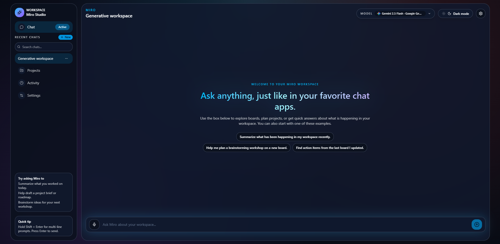
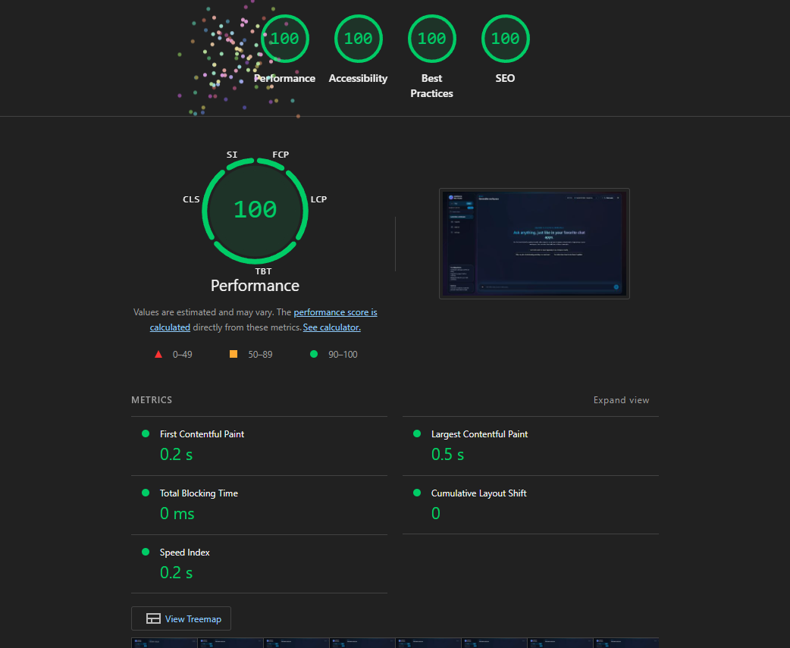

# Miro Workspace

Miro is a **PWA-first AI workspace** for chat and image generation that you can run locally, fork, and extend.

The current **public V1 (beta)** release ships a web PWA plus a small AI backend that you configure with environment variables. Desktop and mobile shells are experimental and part of the roadmap, not required for V1.




---

## Features

- **Chat-first AI workspace** – conversational UI that combines text and image generation in a single thread.
- **Model switcher** – quick access to multiple providers and models, with provider and capability filters.
- **Assistant modes** – Auto / Text / Image / Text + image chips plus a Web search toggle to control how Miro responds.
- **Voice and image input** – optional voice dictation and local image attachment in the chat input bar.
- **Responsive PWA shell** – mobile-friendly header, sidebar, and chat layout you can install as a PWA.
- **Configurable backend** – AI provider and model presets wired through a small Hono API.

---

## Quick start

1. Install Node.js `>= 20.19.0` and [pnpm](https://pnpm.io/).
2. From the `miro/` root, install dependencies:

   ```bash
   pnpm install
   ```

3. Follow [`docs/usage.md`](./docs/usage.md) to configure AI environment variables and run:

   ```bash
   pnpm dev --filter @miro/api
   pnpm dev --filter miro-web
   ```

   Then open `http://localhost:3000` and use Miro in your browser or install it as a PWA.

---

## Architecture (high level)

- **Monorepo** – managed with pnpm workspaces and Turbo.
- **Apps** – `apps/miro-web` (Next.js PWA) and `apps/miro-api` (Hono API).
- **Packages** – shared libraries under `packages/` for DB, auth, and AI integration.
- **Frontend UI** – a modular UI layer inside `apps/miro-web/app/modules/ui`:
  - `components/` – presentational components (model switcher panel, chat input bar, hero, error banner, assistant-mode row).
  - `hooks/` – UI-focused hooks (viewport, scroll, state helpers).
  - `lib/` – shared UI types and helpers.
- **Shell vs. UI** – files under `apps/miro-web/app/shell/` are thin containers that manage state and call into `modules/ui` components.

---

## Docs

Most details now live under [`docs/`](./docs):

- [`overview.md`](./docs/overview.md) – what Miro is and how to extend it.
- [`usage.md`](./docs/usage.md) – local setup, environment, and development workflow.
- [`stack.md`](./docs/stack.md) – libraries and tooling used across the monorepo.
- [`architecture.md`](./docs/architecture.md) – apps, packages, and data/control flow.

Release notes and roadmap:

- [`CHANGELOG.md`](./CHANGELOG.md) – notable changes across public releases.
- [`ROADMAP.md`](./ROADMAP.md) – planned work beyond the current PWA-first beta.

---

## V1 scope

- **Supported surface:** web PWA (`apps/miro-web`) plus AI API (`apps/miro-api`).
- **Experimental:** desktop (`apps/miro-desktop`) and mobile (`apps/miro-mobile`) shells are not required for V1 and may change.

---

## License

Miro Workspace is open-source software licensed under the **MIT License**. See [`LICENSE`](./LICENSE) for the full text.

You are free to use, modify, and self-host Miro, including as part of a commercial or SaaS offering, subject to the terms of the MIT License.
