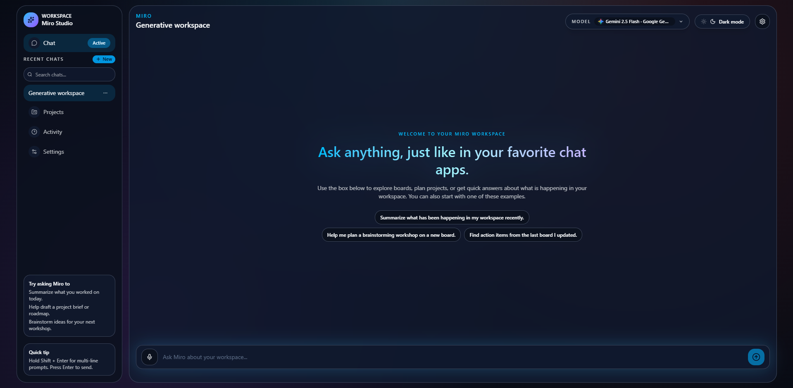
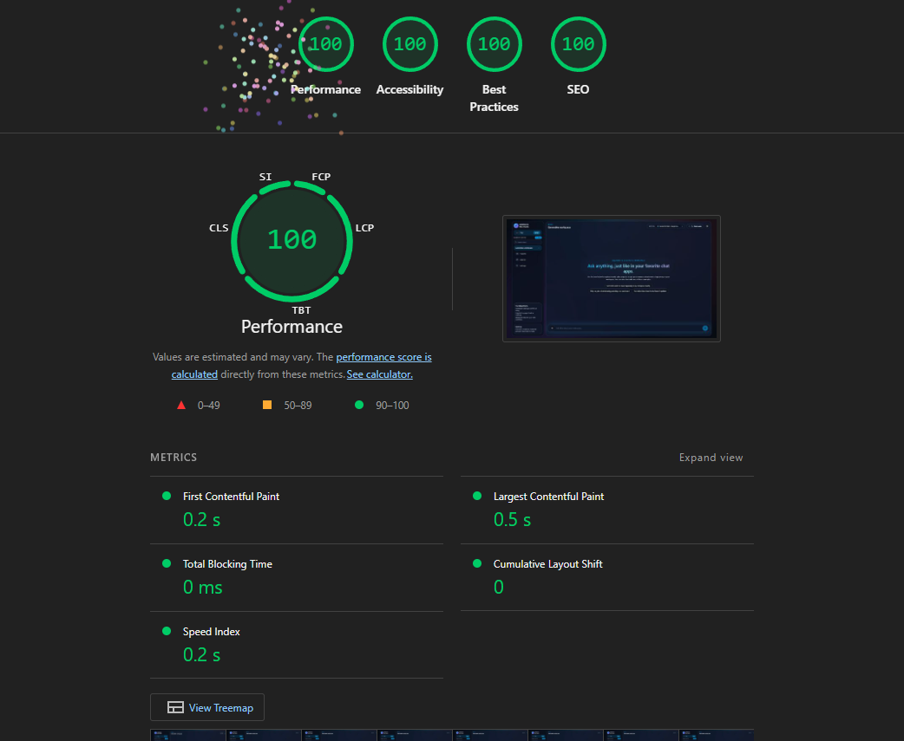

# Miro Workspace

Miro is a **private, local-first BYOK AI studio** — a fast, encrypted client for text and image workflows. Bring your own API keys or connect to local models (Ollama); your keys and chat history stay on your device.

**Current release:** [0.2.0](./CHANGELOG.md) — Tauri desktop packaging, dynamic model discovery, Anthropic, vision, backups. The web PWA remains a **demo and dev** surface. See [`ROADMAP.md`](./ROADMAP.md).




---

## What Miro is

- A **small, modular** AI client — not Docker-heavy platform software
- **BYOK** — OpenAI-compatible, Anthropic, Google, and Ollama via thin adapters
- **Privacy-first** — desktop keys in the OS keychain; encrypted chat + gallery vault
- **Desktop-native** — Tauri v2 installer (`pnpm desktop:release`)
- **Open source** (MIT) — optional coffee-price pre-built desktop builds

## What Miro is not

Be clear before you clone:

| Not this | Instead |
|----------|---------|
| Open WebUI / LibreChat competitor | No RAG, agents, tool hubs, or multi-user SaaS in v1 |
| Multi-tenant AI platform | Single-user client; Postgres/auth is optional experiment only |
| ComfyUI / Stable Diffusion suite | No node graph — curated localhost HTTP bridge (`comfyui` source); cloud API images also supported |
| Mobile product in v1 | Expo is the **next-version** track; **desktop** owns the privacy vault |
| Hosted “Miro cloud” | You run it locally; optional self-host of lean `@miro/api` |

---

## Features

- **Chat-first workspace** — text and image in one thread; streaming markdown
- **Dynamic models** — discover models from your API key, base URL, or local Ollama
- **BYOK + base URL** — OpenAI, OpenRouter, Groq, Anthropic, Google, Ollama
- **Vision** — attach images on supported providers
- **Regenerate / edit** — redo the last turn or revise a user message
- **System prompts** — global defaults + per-chat instructions
- **Export & backup** — Markdown export; passphrase-encrypted backup of chats + gallery
- **Desktop vault** — encrypted SQLite sessions + gallery; OS keychain for secrets
- **API images + Gallery** — OpenAI-compatible + Google Imagen
- **Web PWA** — installable demo/dev shell (browser storage, not E2EE)

---

## Quick start (golden path)

**Under 10 minutes:** [`docs/getting-started.md`](./docs/getting-started.md)

```bash
pnpm install

# Desktop (recommended — privacy story)
pnpm desktop:dev

# Or web demo
pnpm dev   # @miro/api :8787 + miro-web :3100

# Release installer (unsigned)
pnpm desktop:release
```

OpenAI-compatible, Anthropic, Google, or Ollama examples: [`docs/getting-started.md`](./docs/getting-started.md) and [`docs/usage.md`](./docs/usage.md).

---

## Architecture (high level)

- **Monorepo** — pnpm workspaces and Turbo
- **Apps**
  - `apps/miro-desktop` — Tauri v2 (primary product)
  - `apps/miro-web` — Next.js PWA (demo / UI development)
  - `apps/miro-api` — lean Hono API (`@miro/api`) for chat, image, model list
  - `apps/miro-mobile` — Native Expo client (next version; shares `@miro/core`)
- **Packages** — `@miro/core`, `@miro/ai`, `@miro/ui` (+ optional `@miro/db` / `@miro/auth`)

```
miro-web (Next.js)  →  UI, settings, chat
       ↓ embeds
miro-desktop (Tauri) →  keychain, encrypted SQLite, API sidecar
       ↓
packages/ai          →  thin provider adapters + model discovery
miro-api (Hono)      →  lean local AI HTTP (optional self-host)
```

---

## Docs

| Doc | Purpose |
|-----|---------|
| [`docs/getting-started.md`](./docs/getting-started.md) | Install → key → first chat |
| [`docs/usage.md`](./docs/usage.md) | Env vars, providers, discovery, scripts |
| [`docs/desktop.md`](./docs/desktop.md) | Tauri packaging, release checklist, signing |
| [`docs/mobile.md`](./docs/mobile.md) | Native Expo client (next version) |
| [`docs/self-hosting.md`](./docs/self-hosting.md) | Lean `@miro/api` self-host |
| [`docs/overview.md`](./docs/overview.md) | Product overview & extension |
| [`docs/architecture.md`](./docs/architecture.md) | Apps, packages, and data flow |
| [`docs/stack.md`](./docs/stack.md) | Libraries and tooling |
| [`ROADMAP.md`](./ROADMAP.md) | Phases, anti-goals, tiers |
| [`CHANGELOG.md`](./CHANGELOG.md) | Release history |

---

## Release scope (0.2.0)

| Surface | Status |
|---------|--------|
| Tauri desktop | ✅ Primary product (vault, keychain, packaging) |
| Web PWA (`miro-web`) | ✅ Demo / dev — not the privacy story |
| AI API (`@miro/api`) | ✅ Lean BYOK self-host + model discovery |
| Mobile (`miro-mobile`) | 🚧 Native Expo — next version (not the privacy vault) |

Full roadmap: [`ROADMAP.md`](./ROADMAP.md).

---

## License

Miro Workspace is open-source software under the **MIT License**. See [`LICENSE`](./LICENSE).

You may use, modify, and self-host Miro, including in commercial offerings, subject to the MIT License terms.
